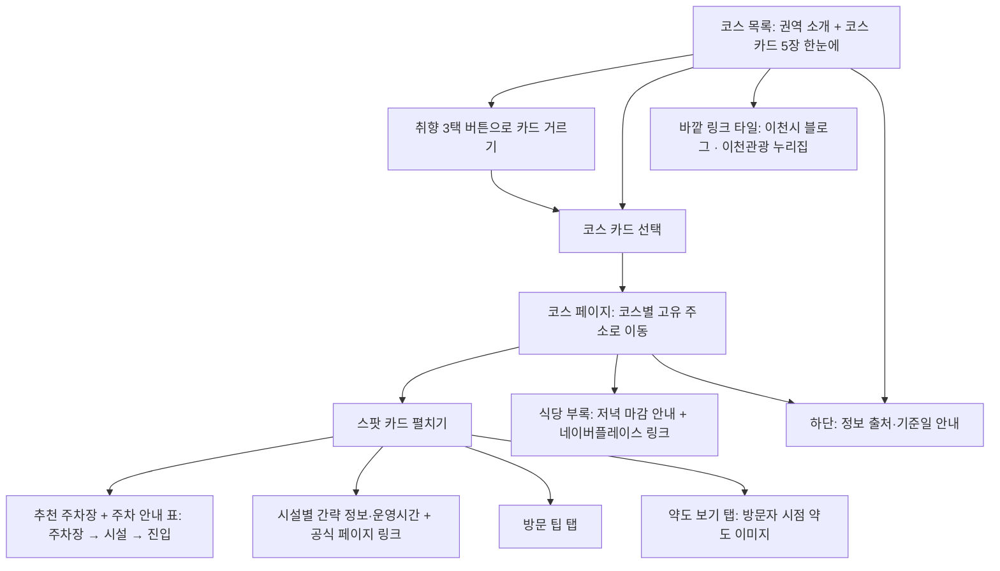

# 이천 아이맵 제품 요구사항 문서

상태: 완료

> 2026-09-15 간략화 재작성, 같은 날 화면 시안 확인 후 사진·기준일 표시·팁 이름을 보완. 2026-09-09 서비스 기획서가 고른 "다음 주에 실제로 만들 핵심 기능 1개"로 범위를 되돌리고, 직접 코스 만들기·그림지도 동선·공유 기능은 v2 후보로 옮겼다. 원본 PRD는 `../ICHEON/docs/prd.md`에 그대로 둔다.

## 1 서비스 한 줄 소개

이천이 낯선 미취학·저학년 아이 동반 가족이 출발 전에 미리 만든 코스 카드를 열어, 가려는 스팟에서 어느 주차장에 대면 원하는 시설로 진입하기 쉬운지를 한눈에 보고, 시설별 운영시간·휴무와 공식 페이지 링크, 방문 팁을 확인하며, 근처 식당은 부록의 네이버플레이스 링크로 바로 확인하는 웹페이지다.

## 2 타깃과 문제 및 대체재

### 핵심 타깃

이천을 처음 방문했거나 지역 동선에 익숙하지 않은 미취학 또는 저학년 아동 동반 가족. 기획서와 원본 PRD의 타깃을 그대로 유지한다.

### 해결할 문제

- 박물관과 전시관의 개관 여부, 임시휴관, 마감시간을 출발 전에 바로 확인하기 어렵다.
- 공원처럼 규모가 큰 장소는 어느 주차장에 차를 두고 어디로 걸어야 아이가 놀 수 있는지 알기 어렵다.
- 체험이나 관람을 마친 뒤 근처 식당을 다시 찾는 과정이 번거롭고, 이천 식당·카페가 18~19시에 일찍 닫는 것을 모르고 저녁을 계획하게 된다.

### 현재 대체재

- 포털 지도와 블로그를 번갈아 보며 운영 정보를 비교한다.
- 장소의 공식 홈페이지나 전화로 당일 운영 여부를 확인한다.
- 현장에서 표지판을 찾거나 직원과 주변 사람에게 동선을 묻는다.

### 근거가 된 현장 장면

- 시립박물관 공사 모습을 보고 휴관으로 오해해 돌아섰지만 실제로는 개관 중이었다.
- 설봉공원에서 놀이터와 조각공원으로 가는 주차 위치와 진입 방향을 찾지 못해 차를 타고 미술관까지 올라갔다.
- 관고시장 쌀 카페가 예상보다 일찍 마감해 저녁 계획을 바꿔야 했다.

### 이번 범위에서 각 장면을 다루는 정도

- 장면 1 개관 오해: 시설별 운영시간·휴무·공식 페이지 링크와 페이지 하단의 기준일 한 줄로 다룬다.
- 장면 2 설봉공원 진입: 스팟 카드의 주차 안내 표(주차장 → 걸어서 갈 수 있는 시설 → 진입 방향)와 코스별 추천 주차장 한 줄로 다룬다.
- 장면 3 저녁 마감: 식당 부록의 네이버플레이스 링크로 영업시간을 확인하게 하고, 부록 상단에 "이천 식당·카페는 18~19시에 닫는 곳이 많으니 저녁은 영업시간을 먼저 확인하세요" 안내 한 줄을 둔다. 영업시간 데이터는 서비스가 저장하지 않으며, 도착 시각 판정 필터는 v2 후보로 남긴다.

## 3 핵심 기능과 부가 기능

### 핵심 기능 1 미리 만든 코스 카드

권역별 1~2개, 총 5개 코스를 운영자가 미리 만들어 카드로 보여준다. 코스 하나는 스팟 1~2개에서 시간을 보내는 구성이다. 코스 이름은 프로그램에서 쓰던 취향 3트랙(만들기 / 야외 활동 / 이야기·문화)에 맞춰 붙여 기획서·답사보고서와 한 줄로 이어지게 한다.

필요한 이유: 스팟 1~2개 조합은 경우의 수가 적어 선택 UI나 AI 추천이 할 일이 거의 없다. 답사 근거로 통제된 코스는 사용자가 무리한 조합을 만들거나 AI가 운영시간을 지어내는 위험을 없앤다.

코스 목록 (확정):

| 권역 | 코스 이름 | 스팟과 추천 주차장 | 이 코스에서 가는 시설 | 취향 트랙 |
|---|---|---|---|---|
| 도심·설봉권 | 설봉공원 이야기·문화 코스 | 설봉공원, 위쪽 주차장 | 시립박물관·월전미술관·도자미술관 | 이야기·문화 (실내, 비 오는 날 OK) |
| 도심·설봉권 | 설봉공원 야외 활동 코스 | 설봉공원, 아래쪽 주차장 | 놀이터·조각공원·호수 산책 | 야외 활동 |
| 남부·모가권 | 남부 만들기 코스 | 이천목재문화체험장 → 이천농업테마공원, 안내센터 옆 주차장 | 목재 만들기 체험 → 후문 쪽 공원(시설 이름은 구현 데이터 작성 때 답사 메모로 확정) | 만들기 |
| 남부·모가권 | 남부 이야기·문화 코스 | 이천농업테마공원, 안내센터 옆 주차장 | 쌀문화전시관·라이스카페 | 이야기·문화 |

(2026-09-18 갱신: 이천농업테마공원의 추천 주차장 이름을 답사 확인에 따라 "안내센터 옆 주차장"으로, 시설 이름을 "쌀문화전시관"으로 바꿨다. 남부 코스 두 개가 같은 주차장을 쓴다.)
| 서이천·마장권 | 서이천 야외 활동 코스 | 덕평공룡수목원 → 이진상회 | 공룡 전시·동물·자연 → 쌀 베이커리·도자 볼거리 | 야외 활동 |

### 핵심 기능 2 스팟 카드: 어느 주차장에 대면 원하는 시설로 가기 쉬운지

코스 상세에서 스팟 1~2개를 카드로 보여준다. 스팟은 장소 단위(설봉공원, 이천농업테마공원, 이천목재문화체험장, 덕평공룡수목원, 이진상회)이고, 주차장은 별도 카드가 아니라 스팟 카드 안의 주차 안내다. (추천 수용) 사용자는 "놀이터에 가고 싶다"에서 출발해 "어디에 대나"를 찾지, 주차장에서 출발하지 않기 때문이다. 카드 항목은 다음과 같다.

- 이 코스의 추천 주차장 한 줄: 코스마다 다르다. 예: 설봉공원 야외 활동 코스에서는 "아래쪽 주차장에 대면 놀이터·조각공원이 가깝다"
- 주차 안내 표: 넓은 곳은 주차장별로 한 줄씩 "주차장 → 걸어서 갈 수 있는 시설 → 진입 방향"을 적는다. 설봉공원은 위쪽·아래쪽 2줄, 이천농업테마공원은 안내센터 옆 주차장을 포함한 2줄(두 번째 주차장 이름은 구현 데이터 작성 때 답사 메모로 확정), 주차장이 하나인 곳은 1줄이다. 주차장마다 네이버지도 링크를 둔다(필수. 화면 글자는 "지도 열기"). 위치 파악과 길찾기는 이 링크가 맡는다. 줄 왼쪽에는 작은 사진 자리(썸네일)를 두고 사진이 없으면 빈 자리로 둔다.
- 시설별 간략 정보: 한 줄 소개, 운영시간·정기휴무 요약(있는 경우), 임시휴관 확인용 공식 페이지·전화 링크. 공식 페이지가 있는 시설은 반드시 링크를 달고, 요금·프로그램·상세 안내는 적지 않고 링크에 맡겨 작성할 데이터를 줄인다. 놀이터·호수 산책처럼 상시 개방인 곳은 운영시간 없이 한 줄 소개만 두고, 줄 끝에 공식 페이지 대신 "지도 열기" 버튼을 둔다. 시설 줄도 주차 안내 줄처럼 왼쪽에 썸네일 자리가 있다.
- 확인일: 카드에는 표시하지 않고 내부 데이터에만 남긴다. 화면에는 페이지 하단 안내에 "운영 정보는 2026-09-04 기준입니다. 방문 전 공식 페이지에서 확인하세요" 한 줄로만 알린다. "직접 답사" 같은 확인 방법도 내부 데이터에만 남긴다.
- 답사하지 않은 주차장·진입 정보에는 "지도 기준 정리, 현장 재확인 예정" 한 줄
- 방문 팁 (선택 항목. 접힌 상태에는 "방문 팁 N" 배지만 보이고, 펼치면 3분할 탭의 "방문 팁 N"을 눌러 목록으로 본다. 내용은 직접 답사한 경험이며 화면 이름은 "방문 팁"으로 쓴다. 형식은 아래 "방문 팁의 표시와 입력 형식" 참고)
- 사진: 접힌 카드에 스팟 대표 사진 1장을 조금 크게 두고, 펼치면 주차장·시설 줄의 썸네일로 추가 사진을 보여준다(선택). 사진이 없는 스팟도 카드가 깨지지 않는다.
- "누르면 자세히" 안내: 접힌 카드에 손가락 아이콘과 짧은 문구를 두어 펼칠 수 있음을 알린다.
- 3분할 탭 (2026-09-18 디자인 단계에서 추가): 펼친 카드의 추천 주차장 한 줄 아래에 "추천 장소 N / 방문 팁 N / 약도 보기" 탭 3개를 두고, 하나를 고르면 그 구역만 보인다. 기본은 "추천 장소"이며 주차 안내 표와 시설 목록이 여기 들어간다. 팁이나 약도가 없는 스팟은 해당 탭을 숨긴다.
- 약도 (선택 항목, 2026-09-18 디자인 단계에서 추가): 스팟마다 "방문자 시점 약도" 이미지 1장을 둘 수 있다. 입구에서 들어가는 순서로 주차장·시설·진입로를 표시한 그림이며, 네이버지도가 실제 운전 감각과 다르게 보이는 문제를 보완한다. 별도로 그려 이미지 폴더에 넣고, 없는 스팟은 "약도 보기" 탭과 구역을 숨긴다.
- "★ 추천" 배지: 코스가 추천하는 스팟의 이름 옆에 작은 배지를 둔다.

필요한 이유: 기획서가 "다음 주에 실제로 만들 핵심 기능 1개"로 고른 항목이다. 답사 5곳 중 3곳에서 열려 있는지 몰라 헛걸음했고, 설봉공원은 어디에 대고 어디로 걸어야 할지 몰라 놀지 못했다. 출발 전 확인을 돕는 것이 이 서비스의 목적이며, 이 기능이 없으면 그 목적을 못 이룬다.

### 부가 기능 식당 부록

코스 상세 맨 아래에 부록으로 둔다. 식당의 영업시간·휴무·메뉴·가격은 서비스에 저장하지 않고 네이버플레이스 링크로 연결해 사용자가 최신 정보를 그곳에서 확인하게 한다. 필수 항목은 "근처 식당 네이버지도에서 보기" 링크뿐이고, 식당 이름과 개별 네이버플레이스 링크, 특징이나 팁 한 줄은 선택 항목으로 두어 시간이 남을 때 채운다. 선택 항목이 비어 있어도 화면이 깨지지 않게 설계한다. 어린이 메뉴, 특·곱빼기, 유아의자, 가격 항목은 두지 않는다.

링크 형태(확정): 코스마다 "근처 식당 네이버지도에서 보기" 검색 링크 1개를 필수로 두고, 식당 이름과 개별 네이버플레이스 링크, 팁 한 줄은 선택 항목이다. 선택 항목을 채울 때는 직접 답사한 푸주옥·강민주의들밥 설봉점·최고당돈가스(도심)에 팁을 먼저 붙이고, 남부·서이천은 이름과 링크만 둔다.

필요한 이유: 관람이나 체험을 마친 뒤 근처 식당을 다시 검색하는 번거로움을 링크 하나로 줄이되, 영업시간처럼 자주 바뀌고 확인 부담이 큰 정보는 네이버플레이스가 더 잘 유지하므로 복제하지 않는다. 식당 정보가 스팟보다 많아지면 서비스 목적이 흐려지므로 부록으로 제한한다.

### 부가 기능 취향 3택 버튼

코스 목록 상단에 만들기 / 야외 활동 / 이야기·문화 버튼 3개를 두고, 누르면 해당 트랙의 코스 카드만 남긴다. 다시 누르면 전체 카드로 돌아온다. 규칙으로 동작하며 AI를 쓰지 않고, 코스 데이터의 트랙 값만 사용하므로 추가 데이터가 없다. 실내·야외는 필터로 두지 않고 카드의 "비 오는 날 OK" 태그로만 표시한다.

필요한 이유: 기획서의 선호 기능 "아이 취향별 하루 코스 추천"이 화면에서 보이게 하는 가장 작은 장치다. 카드 5장에서는 필터보다 트랙별 묶음 안내 역할을 한다.

### 부가 기능 코스 요약 목록과 바깥 링크 타일 (2026-09-18 디자인 단계에서 추가)

- 코스 요약 목록: 코스 목록 화면 맨 위 히어로(서비스 이름 + 한 줄 설명) 바로 아래에 "코스 5개 한눈에" 소제목과 코스 이름·취향 트랙·권역만 있는 5줄을 둔다. 누르면 코스 카드와 같은 상세로 이동한다. 코스 데이터를 그대로 쓰므로 추가 데이터가 없다.
- 바깥 링크 타일: 코스 목록 맨 아래, 하단 안내 위에 타일 2개를 둔다. "이천시 공식 블로그(여행 소식)"와 "이천관광 누리집(공식 관광 정보)"이며 새 창으로 연다. 주소 2개만 데이터에 둔다.

필요한 이유: 요약 목록은 화면을 열자마자 코스 5개의 이름을 스크롤 없이 보여 주고, 링크 타일은 이 서비스가 다루지 않는 축제·행사·숙박 정보를 공식 출처로 넘겨 "추가 정보 수집의 출발점" 역할을 완성한다.

### 조건부 부가 기능 네이버지도 임베드

코스 목록 페이지에 이천 지도 한 장을 넣고 스팟 5곳의 위치를 표시한다. 네이버지도 API(네이버 지도를 내 페이지에 불러오는 공식 통로)를 쓰며, 네이버클라우드플랫폼 가입, Client ID 발급, 사이트 주소 등록이 필요하다. 이 작업은 학습자가 직접 한다.

포함 조건: 2026-09-16(수) 오전에 키 발급까지 30분 안에 끝나면 넣고, 그렇지 않으면 빼고 네이버지도 링크만으로 간다. 빠져도 서비스는 성립한다.

### 방문 팁의 표시와 입력 형식 (확정)

- 표시: 카드가 접혀 있을 때 "방문 팁 N" 배지만 보이고, 펼치면 "방문 팁 N" 탭에서 목록으로 나온다. 팁이 없으면 배지도 탭도 없다.
- 입력 위치: 스팟, 시설, 식당 항목 어디에나 같은 형식의 `tips` 목록을 둘 수 있다. 우선은 스팟에 몰아서 쓴다.
- 넣기와 빼기: 데이터 파일에 문장 한 줄을 추가하거나 삭제하는 것이 전부이며 화면 코드는 고치지 않는다.
- 유형 태그: 문장 앞에 `주차:` `진입:` `아이:` `운영:` `식사:` 중 하나를 붙이면 작은 태그로 표시한다. 붙이지 않으면 태그 없이 문장만 보인다.
- 형식 예시 (형식만 보여주는 예이며 실제 답사 내용이 아니다):

```json
{
  "id": "seolbong",
  "name": "설봉공원",
  "tips": [
    "진입: (답사에서 겪은 한 줄)",
    "(유형 없이 쓴 한 줄)"
  ]
}
```

- 쉬운지 점검: 팁을 5개 넣었다가 모두 빼도 화면은 배지 숫자와 목록만 바뀐다. 문장 안에 큰따옴표를 쓰려면 작은따옴표로 바꾼다. 쉼표 누락 같은 JSON(데이터를 적는 텍스트 형식. 엑셀 표 대신 괄호와 쉼표로 항목을 적는 방식) 문법 오류는 배포 전 검증에서 잡는다.

### 이후 버전의 부가 기능 후보 (v2)

- 도착 예정 시각을 기준으로 열려 있는 식당과 카페만 보기
- 사용자가 스팟을 직접 골라 코스 만들기, 이천 개략 지도의 동선 표시, 링크 공유와 최근 코스 저장 (원본 PRD 핵심 기능 1·2·4)
- AI 코스 추천 (문장을 입력하면 코스를 골라 주는 기능). 서버 함수, API 키 관리, 호출 비용, 지어내기를 막는 응답 검증이 필요해 이번 범위에서 제외했다. 코스가 5개인 동안은 취향 3택 버튼 규칙이 같은 역할을 한다.
- 지친 아이와 잠시 쉴 수 있는 대체 스팟 추천
- 운영시간·휴무를 정기적으로 자동 확인해 갱신하고 기준일을 자동으로 바꾸는 기능. 공식 페이지마다 구조가 달라 자동 수집이 어려우므로, 현실적인 첫 형태는 "월 1회 확인 알림과 기준일 갱신"이다.

## 4 화면 목록과 이동 흐름

주 사용 기기: 모바일 우선. 기준 폭 390px 한 열 배치이며 PC에서는 가운데 기둥(최대 폭 약 640px)으로만 보여준다. (2026-09-16 디자인 단계에서 확정)

1. 코스 목록 화면: 한 페이지에서 코스 5개를 한눈에 본다. 위에서 아래로 히어로(서비스 이름 + 한 줄 설명), 코스 요약 목록 5줄, 3개 권역 소개 한 줄씩, 취향 3택 버튼, 코스 카드 5장, 조건부 이천 지도 한 장(네이버지도 임베드, 스팟 5곳 표시), 바깥 링크 타일 2개, 하단 안내 순서다. 카드에는 코스 이름, 취향 트랙, 권역, 스팟 이름과 추천 주차장, "비 오는 날 OK" 태그를 둔다. (2026-09-18 디자인 시안 기준으로 갱신)
2. 코스 상세 화면: 코스마다 고유 주소를 가진 별도 페이지로 이동한다. 코스 소개 한 줄 아래에 스팟 1~2개를 카드 펼치기로 보여준다. 접힌 상태에는 스팟 대표 사진(조금 크게), 스팟 이름, 이 코스의 추천 주차장 한 줄(예: "아래쪽 주차장에 대면 놀이터·조각공원이 가깝다"), 이 코스에서 가는 시설 이름, 방문 팁 배지, "누르면 자세히" 안내가 보인다. 펼치면 추천 주차장 한 줄 아래에 3분할 탭("추천 장소 N / 방문 팁 N / 약도 보기")이 나오고, "추천 장소"에는 주차 안내 표(썸네일 + 주차장 → 시설 → 진입 + "지도 열기" 버튼)와 시설별 간략 정보·운영시간·공식 페이지 링크, 미답사 정보의 "지도 기준 정리" 표시가, "방문 팁"에는 팁 목록이, "약도 보기"에는 방문자 시점 약도 이미지(선택)가 나온다. 맨 아래에 식당 부록(저녁 마감 안내 한 줄, 근처 식당 링크, 선택 항목인 "추천 식당" 라벨과 식당 이름·팁)을 둔다. 뒤로 가기는 브라우저 기본 동작을 쓴다. 사진의 위치·크기·비율은 디자인 시안(`design/02-코스상세.png`)을 따른다. (2026-09-18 디자인 시안 기준으로 갱신)
3. 정보 출처·기준일 안내: 페이지 하단 영역. "운영 정보는 2026-09-04 기준" 한 줄, 공식 페이지·전화 확인 기준, "지도 기준 정리" 표시의 뜻을 설명한다. 기준일은 데이터 파일의 값 하나를 바꾸면 갱신된다.



## 5 저장할 데이터와 데이터 사용 원칙

### 저장할 데이터

- 권역: 이름, 소개 한 줄
- 코스: 이름, 권역, 취향 트랙, 비 오는 날 OK 여부, 소개 한 줄, 포함 스팟과 순서, 스팟별 추천 주차장과 이 코스에서 가는 시설, 근처 식당 검색 링크
- 스팟: 이름, 권역, 한 줄 소개, 주차장 목록, 시설 목록, 방문 팁(선택), 약도 이미지(선택), 확인일, 확인 방법
- 바깥 링크: 코스 목록 하단 타일 2개의 이름·설명·주소
- 주차장: 이름, 소속 스팟, 위치 설명, 네이버지도 링크(필수), 걸어서 갈 수 있는 시설, 진입 방향 메모, "지도 기준 정리" 여부
- 시설: 이름, 소속 스팟, 한 줄 소개, 운영시간·정기휴무 요약(선택), 공식 페이지 링크(공식 페이지가 있으면 필수), 전화(선택), 방문 팁(선택), 확인일
- 식당 부록: 코스별 근처 식당 검색 링크, 식당 이름과 네이버플레이스 링크(선택), 방문 팁(선택, 스팟과 같은 형식). 영업시간·휴무·메뉴·가격은 저장하지 않는다.
- 사진: 스팟 대표 사진 1장(접힌 카드용)과 주차장·시설 사진 0~n장(펼친 카드의 썸네일용, 선택), 약도 이미지 0~1장(선택). 각 사진에 파일, 대체텍스트, 출처, 촬영일(또는 저작자·라이선스)을 둔다. 직접 촬영분을 우선 쓰고, 없으면 위키미디어 공용처럼 자유 이용 허가(CC) 사진을 출처·저작자·라이선스 표기와 함께 쓴다(2026-09-18 학습자 결정). 사진이 없는 스팟은 사진 없이도 화면이 깨지지 않게 한다. 코스 목록 카드에는 사진을 쓰지 않는다(디자인 시안 기준).

### 데이터 사용 원칙

- 공식 홈페이지, 공공기관 공개 자료, 공식 전화번호, 지도 플랫폼 업체 정보 등 공개 정보와 직접 답사 경험만 쓴다.
- 답사하지 않은 것을 답사한 것처럼 쓰지 않는다. 지도·자료로 채운 진입 정보에는 "지도 기준 정리, 현장 재확인 예정"을 붙이고, 미답사 식당에는 메모 없이 링크만 둔다.
- 팁은 직접 답사한 경험만 문장으로 쓴다. 미답사 스팟과 식당의 팁 칸은 비워 두고, 비어 있어도 화면이 깨지지 않게 한다.
- 공식 페이지가 있는 시설은 링크를 반드시 달고, 설명은 한 줄 소개와 운영시간·정기휴무 요약까지만 적는다. 나머지는 링크에 맡겨 작성할 데이터를 줄인다.
- 운영 정보에는 공식 확인 링크를 붙인다. 확인일은 내부 데이터에 남기고 화면에는 페이지 하단에 기준일 한 줄로만 표시한다. 기준일은 답사일인 2026-09-04이며, 이후 다시 확인하면 그 날짜로 바꾼다. 실시간 개관 여부로 오인될 표현은 쓰지 않는다.
- 유선 확인은 필수가 아니다. 공식 홈페이지나 지도 정보로 확인되면 확인 방법을 "웹 조사"로 남긴다.
- 콘텐츠는 화면 코드와 분리해 `courses.json`, `spots.json`, `restaurants.json` 3개 파일로 관리하고 사진은 별도 이미지 폴더에 둔다. 편집은 파일을 수정해 재배포하는 방식으로 확정한다.

## 6 제외 범위

- 사용자가 스팟을 직접 골라 코스 만들기와 순서 바꾸기
- 직접 그린 이천 개략 지도와 스팟 사이 동선 표시 (위치는 주차장별 네이버지도 링크로, 조건이 맞으면 네이버지도 임베드로 대체). 스팟 안의 진입로를 그린 "방문자 시점 약도"는 2026-09-18부터 선택 항목으로 포함 범위다.
- 코스 링크 공유와 최근 코스 로컬 저장
- AI 추천
- 도착 시각을 넣어 열린 식당을 판정하는 필터 (네이버플레이스 링크로 대체)
- 식당의 영업시간·휴무·메뉴·가격 등 운영 정보 저장 (네이버플레이스 링크로 대체)
- 실내·야외 필터 (카드 태그로만 표시)
- 어린이 메뉴, 특·곱빼기, 유아의자 등 식당 세부 항목과 가격
- 실시간 운영 여부 자동 수집, 로그인·회원가입, 예약·결제, 리뷰·댓글, 위치 추적·길찾기, 이동시간 계산

## 7 성공 기준

- 코스 카드 5장이 모두 열리고, 각 코스 상세에 스팟 카드 1~2개와 식당 부록 링크가 표시되며 링크가 네이버지도에서 열린다.
- 취향 3택 버튼을 누르면 해당 트랙의 코스 카드만 남고, 다시 누르면 5장 전체로 돌아온다.
- 코스 페이지 주소를 복사해 다른 기기에서 열면 같은 코스가 나온다.
- 스팟 카드의 모든 주차장에 네이버지도 링크가 있고, 누르면 해당 위치가 열린다.
- 팁은 데이터 파일에 문장 한 줄을 넣거나 빼는 것만으로 화면에 반영되며 코드 수정이 없다.
- 사진·팁·약도가 없는 스팟도 카드가 정상으로 표시되고, 없는 항목의 탭은 숨겨진다.
- 페이지 하단에 운영 정보 기준일 한 줄이 표시되고, 데이터 파일의 값 하나로 갱신된다.
- 공개하는 모든 스팟 카드에 추천 주차장 한 줄과 주차 안내 표(주차장 → 시설 → 진입)가 빠짐없이 있고, 공식 페이지가 있는 시설은 모두 링크가 연결되어 열린다.
- 답사하지 않은 진입 정보와 식당에는 예외 없이 "지도 기준 정리" 표시 또는 링크만 두기 규칙이 적용된다.
- 처음 보는 사용자가 코스 페이지를 열면 카드를 펼치지 않고도 이 코스에서 어느 주차장에 대야 하는지 보이고, 펼치면 설봉공원·이천농업테마공원의 주차장별 연계 시설을 한 표에서 볼 수 있다.
- 2026-09-17(목)까지 3개 화면 구현을 마치고 2026-09-18(금)에 배포한다. (2026-09-18 현재 디자인 단계 완료, 구현 전. 새 목표일은 3단계 기능 명세에서 다시 정한다.)

## 8 예상 복잡도

작음 — 화면 3개, 정적 데이터 파일 3개이고 로그인·결제·실시간 연동·상태 관리가 없다. 복잡도를 높이는 요인은 코드가 아니라 데이터다. 2026-09-18 디자인 단계에서 3분할 탭, 요약 목록, 링크 타일, 약도 구역이 추가되어 화면 요소는 늘었지만 데이터는 약도 이미지(선택)와 링크 주소 2개만 는다. 식당 운영 정보를 저장하지 않으므로 확인 대상은 스팟 5곳(설봉공원, 이천농업테마공원, 이천목재문화체험장, 덕평공룡수목원, 이진상회)의 주차장 7곳과 시설 12곳 안팎뿐이지만, 주차장 구분과 운영시간·휴무를 공식 자료로 확인하는 일과 화·목 14시 이후만 가능한 작업 시간이 제약이다.

## 아직 확인할 결정

- 이천농업테마공원의 두 번째 주차장 이름과 남부 만들기 코스에서 가는 공원 시설의 이름 (구현 데이터 작성 때 답사 메모로 확정)
- 구현 완성과 배포의 새 목표일 (3단계에서 정한다)

## 확정 시 유지하는 운영 가정

- 구현 완성은 2026-09-17(목), 배포는 2026-09-18(금)이다. 작업 가능 시간은 화·목 14시 이후, 수요일 종일이다.
- 코스와 스팟은 운영자가 미리 만든 정적 데이터이며 사용자는 고르기만 한다.
- 코스 상세는 코스별 고유 주소를 가진 페이지이며, 그 안에서 스팟은 카드 펼치기로 보여준다.
- 주차장은 별도 카드가 아니라 스팟 카드 안의 주차 안내 표이며, 코스마다 추천 주차장 한 줄을 따로 둔다. (추천 수용)
- 지도는 주차장별 네이버지도 링크가 기본이다. 네이버지도 임베드는 2026-09-16(수) 오전 키 발급이 30분 안에 되는 경우에만 넣는다.
- AI 코스 추천은 v2다. 이번 버전의 추천은 취향 3택 버튼 규칙으로만 동작한다.
- 디자인 기준은 Claude Design 앱 시안 PNG 3장(`design/01-코스목록.png`, `02-코스상세.png`, `03-하단안내.png`)이며, 색·글자·간격 값은 `docs/design-prompt.md` 5절을 따른다. (2026-09-18)
- 기획서와 달라진 점: 필요 기능 3번 "도착 시각 기준 열린 식당·카페만 보기"는 v2로 미루고, 식당 부록의 네이버플레이스 링크와 "일찍 닫는 곳이 많다" 안내 한 줄로 대체한다. 식당 운영 정보는 서비스에 저장하지 않는다. (R3 수정)
- 식당은 부록이다. 확인 부담이 있는 정보는 네이버플레이스에 맡기고, 특징·팁은 시간이 남을 때만 채운다.

## 기획서와의 연결

| 기획서 항목 | 이번 PRD에서의 위치 |
|---|---|
| 필요 1 장소별 운영시간·휴무·마감 + 공식 링크 | 핵심 기능 2 (시설별 운영시간·공식 페이지 링크) |
| 필요 2 주차장 기준 진입 동선 안내 | 핵심 기능 2 (스팟 카드의 주차 안내 표와 코스별 추천 주차장) |
| 필요 3 도착 시각 기준 열린 식당·카페 | v2 후보. 식당 부록의 네이버플레이스 링크와 저녁 마감 안내 한 줄로 대체 |
| 선호 아이 취향별 하루 코스 추천 | 핵심 기능 1 (취향 3트랙 코스) + 취향 3택 버튼 (1차 부가 기능) |
| 선호 아이와 나눠 먹기 메뉴 정보 | 식당 부록의 선택 항목 팁 한 줄 (답사 3곳, 시간 남으면) |
| 선호 지친 아이와 쉴 대체 스팟 | v2 후보 |
